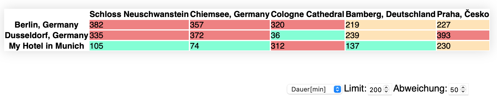

= Distance and Duration

This is a webservice that provides an easy way to compare distances and durations (by car) between user defined locations.

== Example

Let's say you are planning to go on vacation in germany.
You have already booked hotels in three different locations:

[source,csv]
----
include::data/locations.csv[]
----

And you have a list of sights you want to visit:

[source,csv]
----
include::data/destinations.csv[]
----
This webservice will present you the shortest path between your hotels and the sights, so you don't waste any time on the road!

== Technical Aspects

* You can specify arbitrary location names if you provide coordinates
* You must specify a valid/commonly known location name if you don't provide coordinates
* Location names without coordinates are enhanced by coordinates using OpenRouteService
** This implies that the location and destination files must be writable by the container user
* OpenRouteService is also used to figure out the distances and durations between the individual locations
** So you must specify a personal API Key otherwise the webservice can't access OpenRouteService
